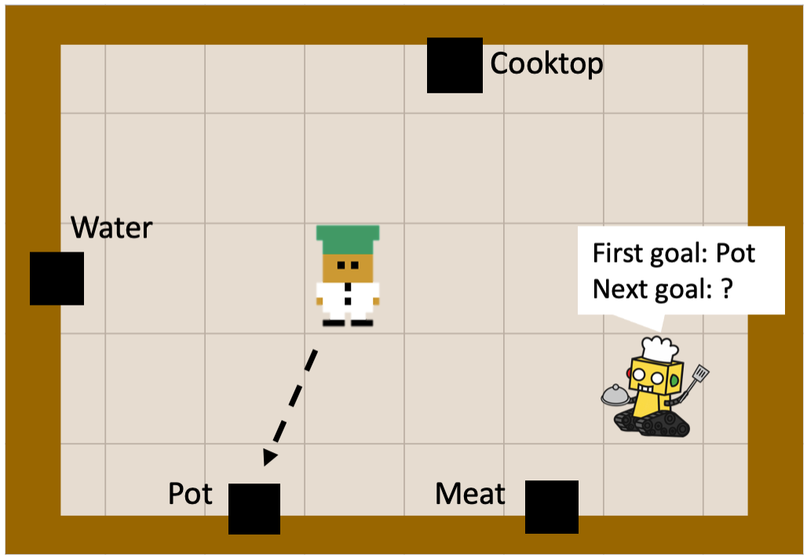

## HIMO: Logic-Based Hierarchical Intent Monitoring for Mobile Robots

HIMO is a framework that uses temporal logic specifications to infer the unknown intent of a robotic agent through passive observations of its actions over time.

   
  <i>Intent monitoring can be key to enabling a human-robot collaboration. If the robot is aware of that chef’s intent is to repeatedly bring a pot, water, meat, in order, and then go to the cooktop, it can help the chef by bringing meats while he is going to get some water, or can avoid collisions predicting their future positions.</i>

---

## You can test HIMO

Test HIMO on following two environments:
- a random environment in `High-level-monitor.ipynb`
- a TH&Ouml;R dataset in `thor_test.ipynb`.

### TH&Ouml;R Dataset
For more details about TH&Ouml;R Dataset, see http://thor.oru.se/.